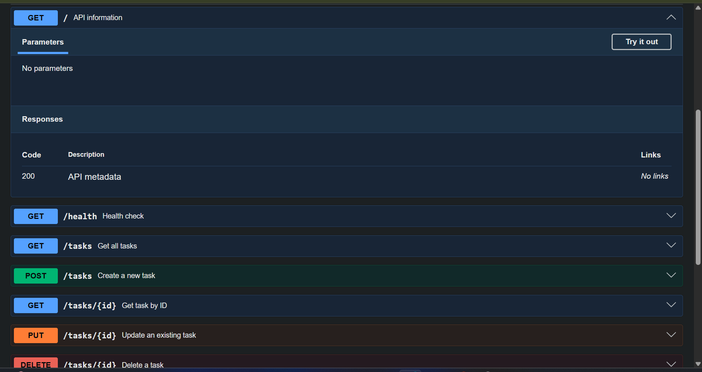

# to-do-list

A minimal, in-memory Task API built with Express 5. Tasks live in a plain
JS array in memory, and the API is self-documented via
Swagger UI at `/docs`, backed by `docs/openapi.json`.

## Install & Run

```bash
git clone https://github.com/DaQshin/to-do-list.git && cd to-do-list && npm install && npm start
```

The server starts on **http://localhost:3000**. Interactive API docs are at
**http://localhost:3000/docs**.

## Endpoints

| Method | Path         | Description                | Success         | Notes                                                   |
| ------ | ------------ | -------------------------- | --------------- | ------------------------------------------------------- |
| GET    | `/`          | API metadata               | 200             | Returns name, version, endpoint list                    |
| GET    | `/health`    | Health check               | 200             | `{ "status": "ok" }`                                    |
| GET    | `/docs`      | Swagger UI                 | 200             | Renders `docs/openapi.json`                             |
| GET    | `/tasks`     | List all tasks             | 200             | Returns `{ tasks: [...] }`                              |
| POST   | `/tasks`     | Create a task              | 201             | Body: `{ "title": string }`                             |
| GET    | `/tasks/:id` | Get a single task by id    | 200 / 404       | 404 body currently returns w/o `return`, see note below |
| PUT    | `/tasks/:id` | Update a task's title/done | 202 / 400 / 404 | Body: `{ "title"?: string, "done"?: boolean }`          |
| DELETE | `/tasks/:id` | Delete a task by id        | 204 / 404       |                                                         |

## Example request

```bash
curl -i http://localhost:3000/tasks
```

```
HTTP/1.1 200 OK
X-Powered-By: Express
Content-Type: application/json; charset=utf-8
Content-Length: 166
ETag: W/"a6-PyusM64H3IkmA2Qf33KtNtRZDY8"
Date: Sat, 08 Aug 2026 17:11:23 GMT
Connection: keep-alive
Keep-Alive: timeout=5

{"tasks":[{"id":1,"title":"Learn Express.js","done":false},{"id":2,"title":"Build Todo API","done":true},{"id":3,"title":"Write Swagger Documentation","done":false}]}
```

## Swagger UI


